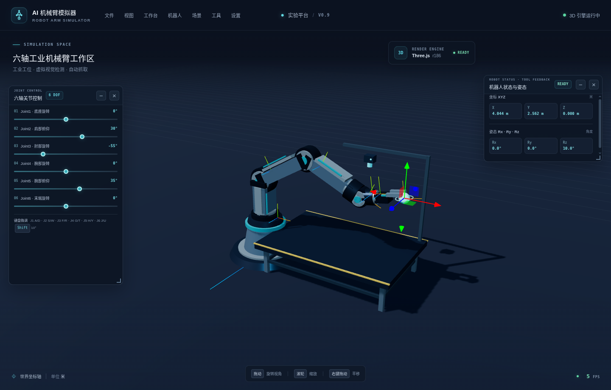
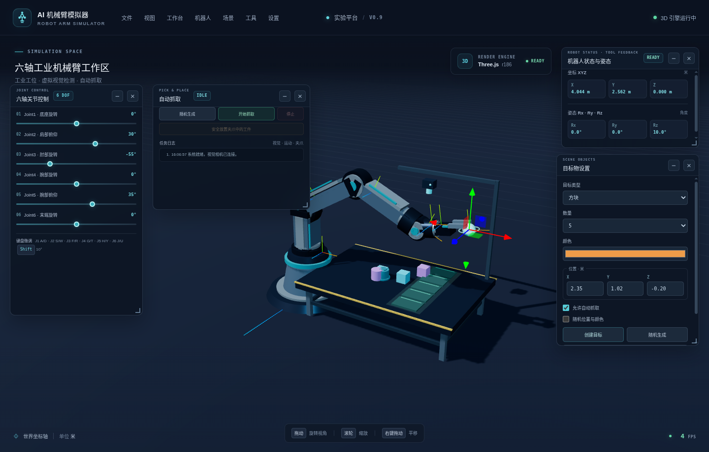

# AI Robot Arm Simulator

[简体中文](README.md) | **English**

A 3D workbench for simulating a six-axis robot arm, with joint controls, forward/inverse kinematics, pick-and-place, and a configurable card-based UI. Current release: **v1.0.0**.

## Download the Windows desktop app

- [GitHub Release](https://github.com/lyh355016875-ui/Robot-Arm-Simulator/releases/tag/v1.0.0)
- [Windows x64 installer](https://github.com/lyh355016875-ui/Robot-Arm-Simulator/releases/download/v1.0.0/Robot-Arm-Simulator-1.0.0-win-x64.exe)
- [Windows x64 portable app](https://github.com/lyh355016875-ui/Robot-Arm-Simulator/releases/download/v1.0.0/Robot-Arm-Simulator-1.0.0-portable-x64.exe)
- [SHA-256 checksums](https://github.com/lyh355016875-ui/Robot-Arm-Simulator/releases/download/v1.0.0/SHA256SUMS.txt)

Verify a download in PowerShell (replace the filename if needed):

```powershell
Get-FileHash .\Robot-Arm-Simulator-1.0.0-win-x64.exe -Algorithm SHA256
```

Compare the result with the matching entry in `SHA256SUMS.txt`.

## Project structure

```text
.
├── assets/                 # Static assets
├── docs/screenshots/       # README interface screenshots
├── electron/               # Desktop main process and preload
├── scripts/                # Local server and automated tests
├── src/
│   ├── controller/         # Joint, target-pose, and pick-and-place control
│   ├── kinematics/         # Forward/inverse kinematics and matrix helpers
│   ├── robot/              # Arm, joints, links, gripper, and workbench
│   ├── ui/                 # Cards, layouts, menus, and workspace modes
│   └── main.js, scene.js, renderer.js, camera.js, RobotSensors.js
├── index.html              # Browser entry point
└── package.json            # Dependencies, scripts, and desktop build config
```

## Features

- Six-axis joint sliders and keyboard controls with joint limits.
- Forward/inverse kinematics and end-effector pose control.
- Scene-based pick-and-place simulation.
- Workbench cards that can be moved, collapsed, hidden, resized, and saved.
- End-effector camera, distance, force/torque, and other **simulated** sensors.

> Sensors, vision, and communication events are simulated; the app does not connect to a physical robot or real sensors.

## Screenshots



The main workbench shows the 3D robot scene, joint controls, and live pose feedback.



The pick-and-place view shows task status, object settings, and simulated parts on the workbench.
Screenshots were captured with software rendering in a virtual environment; the displayed FPS is not representative of typical user hardware.

## Technology

- **Browser:** HTML, CSS, vanilla JavaScript, Three.js 0.186.0, and WebGL 2.
- **Desktop:** Electron 44 with an isolated renderer, preload, and local app protocol; Three.js is bundled.
- **Tests and releases:** Node.js built-in test runner; GitHub Actions builds Windows x64 installer/portable packages and SHA-256 checksums.

## Run and develop

The Windows desktop app bundles Three.js and requires Windows x64 plus a WebGL 2-capable GPU/driver. The browser version can be opened from `index.html`, but it loads Three.js from a CDN and therefore requires an internet connection.

Requires Node.js 22 or compatible:

```bash
npm ci
npm run desktop       # Run locally for development
npm test              # Kinematics and pick-and-place unit tests
npm run dist:win      # Build the installer and portable app on Windows
```

GitHub Actions tests and builds the Windows x64 packages, then generates SHA-256 checksums when a `v*` tag matches the version in `package.json`. New releases are uploaded as drafts for a maintainer to review and publish.

## License

[MIT](LICENSE).
