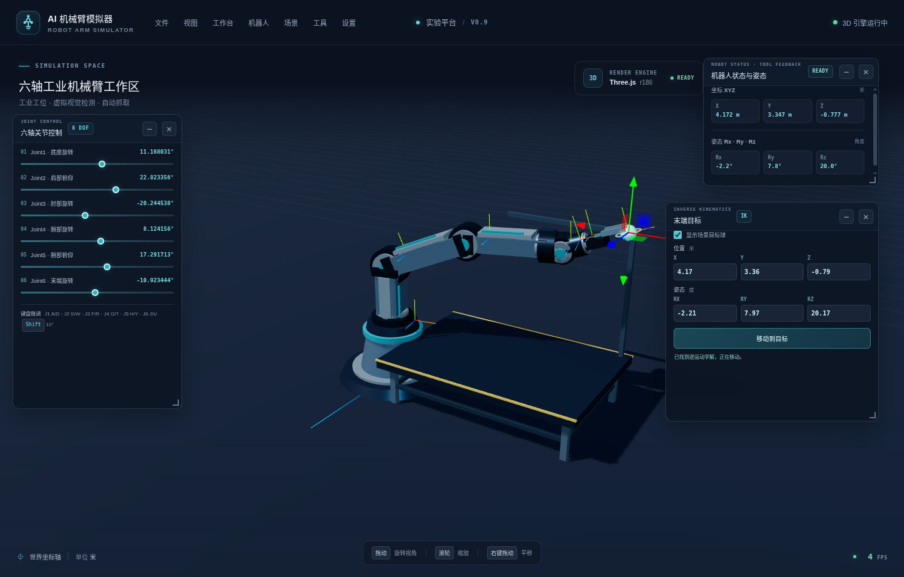
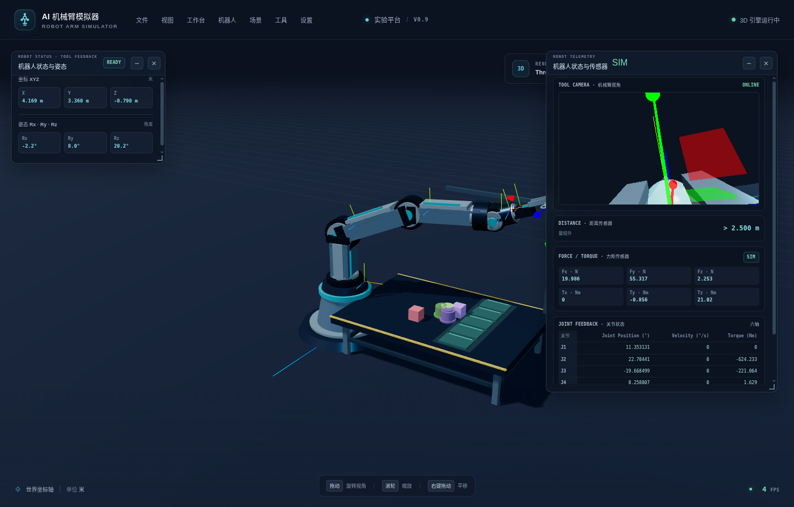
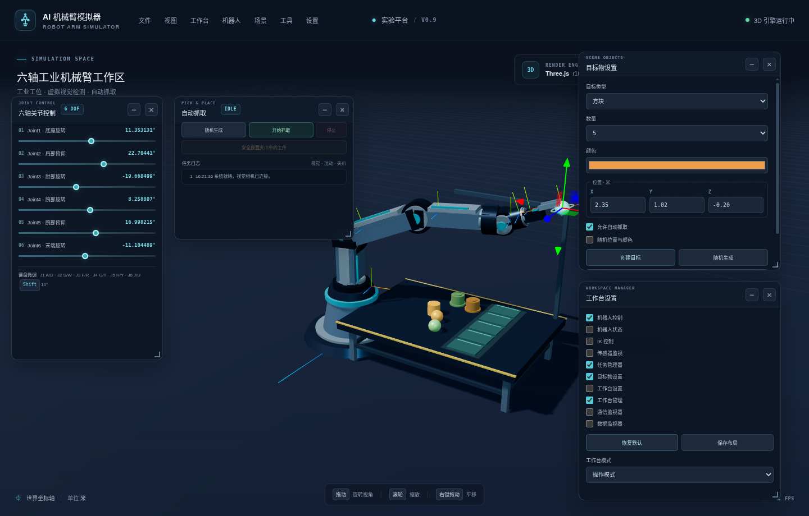
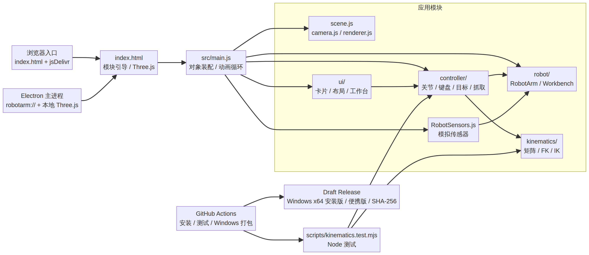
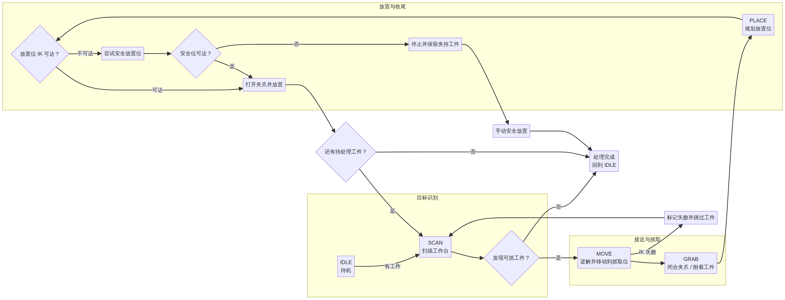

# AI Robot Arm Simulator

[简体中文](README.md) | **English**

A Three.js-based 3D simulator for six-axis robot arms, available in the browser and as a Windows desktop app. It includes forward/inverse kinematics, joint and end-effector controls, pick-and-place, workcell configuration, and simulated sensor feedback.

- **Current release:** v1.0.0
- **Use cases:** Kinematics demonstrations, interactive simulation, and frontend development
- **Important boundary:** This is a simulator; it does not connect to a physical robot, camera, or sensor.

## Download the Windows desktop app

- [GitHub Release](https://github.com/lyh355016875-ui/Robot-Arm-Simulator/releases/tag/v1.0.0)
- [Windows x64 installer](https://github.com/lyh355016875-ui/Robot-Arm-Simulator/releases/download/v1.0.0/Robot-Arm-Simulator-1.0.0-win-x64.exe)
- [Windows x64 portable app](https://github.com/lyh355016875-ui/Robot-Arm-Simulator/releases/download/v1.0.0/Robot-Arm-Simulator-1.0.0-portable-x64.exe)
- [SHA-256 checksums](https://github.com/lyh355016875-ui/Robot-Arm-Simulator/releases/download/v1.0.0/SHA256SUMS.txt)

Verify a download in PowerShell:

```powershell
Get-FileHash .\Robot-Arm-Simulator-1.0.0-win-x64.exe -Algorithm SHA256
```

Compare the result with the entry for the same filename in `SHA256SUMS.txt`.

## Interface tour

### Main workbench: joint controls and robot status


Use the six sliders on the left to control the joints. The status panel shows the end-effector XYZ position and Rx/Ry/Rz orientation; the 3D scene supports orbit, zoom, and pan.

### Pick-and-place: task, parts, and workbench


Generate workpieces, review task status and logs, and configure object type, count, color, and position.

### End-effector target: interactive inverse kinematics



Enter a target position and orientation or drag the target marker in the scene. The simulator calculates joint angles and animates the arm toward the target when possible.

### Sensor monitor: simulated telemetry



Inspect the tool-mounted camera, distance reading, estimated force/torque, and joint feedback. All readings are calculated from the simulated scene and simplified models.

### Workbench configuration: cards and modes



Show or hide control, status, IK, task, and monitor cards; switch between operation, debug, monitor, and minimal modes.

> Screenshots were captured with software rendering in a virtual environment; the displayed FPS is not representative of typical user hardware.

## Features and controls

| Feature | How to use it | Notes |
| --- | --- | --- |
| Six-axis control | Drag the J1–J6 sliders or use keyboard shortcuts | Each joint has angle limits |
| Keyboard control | J1: A/D; J2: S/W; J3: F/R; J4: G/T; J5: H/Y; J6: J/U | Hold `Shift` to adjust in 10° increments |
| Scene camera | Left-drag to orbit, scroll to zoom, right-drag to pan | Controls the Three.js scene camera |
| End-effector target | Enter X/Y/Z and RX/RY/RZ, or drag the target marker | Position uses meters; UI orientation uses degrees |
| Pick-and-place | Generate workpieces, then start the task | States progress through `SCAN`, `MOVE`, `GRAB`, and `PLACE` |
| Workbench layout | Move, resize, collapse, or hide cards; save a layout from the menu | Layout is stored in the app's browser storage |
| Scene configuration | Choose workbench, object type/count, position, and color | Supports cubes, spheres, cylinders, and custom parts |
| Monitoring | Open data, event, and sensor cards | Intended for simulation and development only |

**Stopping and recovery:** If the gripper has not picked up a part, the current motion can be cancelled. If a stop is requested during placement, the app finishes the current placement first. If automatic placement cannot be completed, the part may remain held and can be put down using the recovery action.

## How it works

### System architecture

The browser and Electron desktop app share the same HTML, JavaScript, and Three.js scene. `src/main.js` assembles the runtime and drives the animation loop; controllers connect kinematics, the robot model, and the UI.



The [editable Mermaid source](docs/architecture.mmd) is included in the repository.

### Pick-and-place state flow



The [editable Mermaid source](docs/pick-place-flow.mmd) is available for future updates. In short: scan for a part → solve approach and pick poses → close the gripper → solve a placement pose → place and continue scanning. Unreachable targets are skipped; if the regular placement pose is unreachable, the controller attempts a safe fallback position.

## Code map

| Path | Responsibility | Typical changes |
| --- | --- | --- |
| `index.html` | Browser entry, base panels, and Three.js loading bootstrap | Edit built-in control cards, startup resources, or page structure |
| `electron/main.cjs` | Electron main process, custom `robotarm://` protocol, and window security | Change desktop startup or static resource access |
| `electron/preload.cjs` | Minimal desktop capability exposed to the isolated page | Extend the renderer's desktop-facing API |
| `src/main.js` | Initializes the scene, robot, controllers, panels, and animation loop | Change module wiring or per-frame update order |
| `src/scene.js`, `camera.js`, `renderer.js` | Three.js scene, camera, orbit controls, and renderer | Change lighting, view, shadows, or rendering settings |
| `src/robot/` | Joints, links, end effector, robot hierarchy, and workcell parts | Change geometry, joint axes, workpieces, or grasp behavior |
| `src/kinematics/` | Matrix helpers, forward kinematics (FK), and inverse kinematics (IK) | Change transforms, joint limits, or convergence behavior |
| `src/controller/` | Joint, keyboard, target-pose, pick-and-place, and pose-display logic | Add controls or change task behavior |
| `src/RobotSensors.js` | Simulated tool camera, distance, force/torque, and joint feedback | Extend sensor models or monitoring data |
| `src/ui/` | Cards, layout persistence, menus, workspace modes, and monitors | Add cards, layout presets, or workspace modes |
| `scripts/kinematics.test.mjs` | Automated FK, IK, and pick-and-place tests | Add regression coverage for motion or task changes |
| `.github/workflows/windows-release.yml` | Tag-triggered tests, Windows build, and draft release | Change CI or release behavior |

### Repository layout

```text
.
├── assets/                         # Static assets
├── docs/
│   ├── architecture.mmd / .png     # Architecture diagram and editable source
│   ├── pick-place-flow.mmd / .png  # Task flow diagram and editable source
│   └── screenshots/                # Real interface screenshots in this README
├── electron/
│   ├── main.cjs                    # Electron main process
│   └── preload.cjs                 # Isolated preload script
├── scripts/
│   ├── serve.mjs                   # Local browser development server
│   └── kinematics.test.mjs         # Automated tests
├── src/
│   ├── controller/
│   ├── kinematics/
│   ├── robot/
│   ├── ui/
│   ├── RobotSensors.js
│   ├── camera.js / renderer.js
│   ├── main.js / scene.js
│   └── styles.css
├── index.html
├── package.json / package-lock.json
└── .github/workflows/windows-release.yml
```

## Core design notes

### Coordinates, units, FK, and IK

- Scene positions are in **meters**. Joint angles and RX/RY/RZ in the UI are in **degrees**.
- `forwardKinematics()` and `inverseKinematics()` expect joint and orientation angles in **radians**. The UI controllers convert between degrees and radians.
- Keep the transform sequence in `src/kinematics/forward.js` consistent with the `Object3D` hierarchy and joint axes in `src/robot/RobotArm.js`.
- IK uses a damped numerical-Jacobian iteration, enforces six joint limits, and returns convergence status, position error, orientation error, and iteration count. For unreachable targets, inspect the error values rather than treating any returned angle set as a successful solution.

### Animation loop and controllers

The `src/main.js` loop updates camera controls, target motion, the pick-and-place state machine, sensors, and monitor panels before rendering. Per-frame `delta` is capped to avoid large simulation jumps after stalls. When changing controllers, preserve cancellation and stale-async-result guards so an old task cannot overwrite a newer user action.

### Cards and layouts

- Built-in robot, IK, and sensor cards live in `index.html`; task, scene-setting, and monitor cards are created by `WorkspaceManager`.
- Give new cards a stable `data-card-id`, and update the card list, menu, and workspace-manager controls in `WorkspaceManager.js`.
- Add position, size, and visibility entries to the default, operation, debug, and minimal presets in `LayoutManager.js`.
- Card positions and workspace mode are stored in `localStorage`. If the saved state shape changes, consider compatibility with existing data and the restore-default path.

## Local development

### Requirements

- Node.js 22 or compatible, plus npm.
- Browser mode requires a WebGL 2-capable browser/GPU driver and network access to jsDelivr for Three.js.
- Windows release builds require a Windows x64 environment. The desktop app bundles Three.js and does not download the engine from a CDN at runtime.

### Install and run

```bash
git clone https://github.com/lyh355016875-ui/Robot-Arm-Simulator.git
cd Robot-Arm-Simulator
npm ci
```

Run the browser development server:

```bash
npm run dev
```

Open the local URL printed in the terminal (default: `http://127.0.0.1:8000/`). You can also open `index.html` directly; if Three.js does not load, use the local server and check network access.

Run the Electron desktop app for development:

```bash
npm run desktop
```

### Tests and builds

```bash
npm test              # FK, IK, joint limits, and pick-and-place tests
npm run pack:dir      # Package an unpacked app for the current OS
npm run dist:win      # Build the Windows x64 installer and portable app
```

Automated tests primarily cover kinematics and the pick-and-place state machine; they are not a full UI/Electron end-to-end suite. After changes to the page, cards, WebGL, or Electron startup, also smoke-test engine startup, joint movement, reachable/unreachable IK, workpiece generation, task stopping, and layout save/restore in a browser or desktop app.

## Suggestions for future development

1. **Kinematics:** Update `src/kinematics/` and add tests for representative poses, joint limits, and unreachable targets in `scripts/kinematics.test.mjs`.
2. **Pick-and-place:** Review the `SCAN → MOVE → GRAB → PLACE` transitions, stop timing, and held-part recovery before changing task behavior.
3. **New UI cards:** Decide whether the card belongs in static `index.html` or is built by `WorkspaceManager`, then update the card list, menu, workspace manager, and layout presets.
4. **Sensors:** Label values as simulated or measured. There are no physical hardware drivers, so estimated values must not be presented as device data.
5. **Before committing:** Run `npm test`; for UI or rendering changes, perform a manual smoke test as well.

## Release workflow

Pushing a `v*` tag triggers GitHub Actions to validate the tag against the version in `package.json`, install locked dependencies, run tests, build the Windows x64 installer and portable package, and generate SHA-256 checksums. Successful artifacts are uploaded to a **Draft Release** for a maintainer to review and publish.

Before a new release, update `package.json` and `package-lock.json` together, and make sure the tag matches the package version. Do not create a release tag without running the test and build checks.

## Scope and limitations

- Robot motion, collision/target detection, camera imagery, distance, force/torque, and communication events are simulated or estimated.
- This project does not include physical hardware drivers, safety certification, or real robot control. Do not use simulation results to operate or safety-certify physical equipment.
- IK depends on the model, joint limits, and numerical convergence. Unreachable poses return a best-effort result and error values; verify reachability before interpreting the motion.
- Browser mode loads Three.js from a CDN; the Windows desktop app bundles its engine resources.

## License

[MIT](LICENSE).
